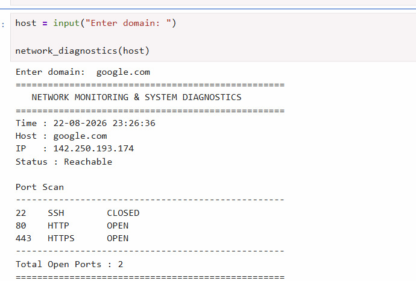

# Network Monitoring and System Diagnostics Tool

A Python-based network diagnostics application that monitors host connectivity, resolves DNS records, and scans common TCP ports.

## Features

- DNS lookup (Domain → IP Address)
- Host availability check using Ping
- Port scanning for SSH, HTTP, and HTTPS
- Timestamped diagnostic report
- Simple command-line interface

## Technologies Used

- Python
- Socket Programming
- Subprocess
- Linux / Windows Networking

## Ports Scanned

| Port | Service |
|-------|----------|
| 22 | SSH |
| 80 | HTTP |
| 443 | HTTPS |

## Project Workflow

1. User enters a domain
2. Resolve DNS
3. Check host reachability
4. Scan ports
5. Generate diagnostic report

## Example Output

NETWORK MONITORING & SYSTEM DIAGNOSTICS

Host : google.com

IP : 142.xxx.xxx.xxx

Status : Reachable

22 SSH CLOSED

80 HTTP OPEN

443 HTTPS OPEN

## Example Output

